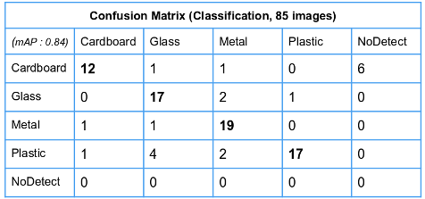

# Train a Wall-E
This repository provides a custom object-detection model to sort recyclabes from trash. This [Google Slides](https://docs.google.com/presentation/d/1zeNFiWiGkVjS7e59hS5mzyFpvdS8Ayi5G3jqLYzYhPY/edit?usp=sharing) provides a briew overview of the project.
 
## Dataset
The dataset was obtained from <https://github.com/patil215/scrapsort/tree/master/training_data/v2>. It has 2400 images of common recyclable materials belonging to 5 classes - Metal , Paper, Cardboard, Glass, Plastic. The images contained trash objects at different angles on a white background. I droped the Plastic class, as it was found to be problematic.  Images did not have bounding boxes and so I manually labelled approximately 170 images per class using [labelImg](https://github.com/tzutalin/labelImg). The annotated training data is available in data folder. 

## Model & Training
I have used keras-yolo v2 model. I modified config file to include my own anchor boxes and labels. Also, I have modified the loss function from the original, to suit my dataset. To build the mode with, download  To train the model, make sure weights for the backend are downloaded and then run 
 to the current directory
``` 
cd keras-yolo2
python train.py -c config.json

```

## Results
- Mean Average Precision = 0.84
- Confusion Matrix :
 


## Run Inference
Run the predict.py file in keras-yolo2 folder with a directory of images as its input. The output of the inference i.e. predicted bounding boxes, will be overlaid on top of the images and saved in the same directory.
```
cd keras-yolo2
python predict.py -c config.json -w full_yolo_trash.h5 -i ~/data/processed/test/

```
- Inference time (on Tesla K80) = 0.061 +/- 0.09  (s)
- A sample test image: 
